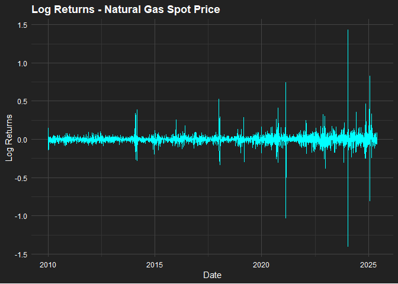
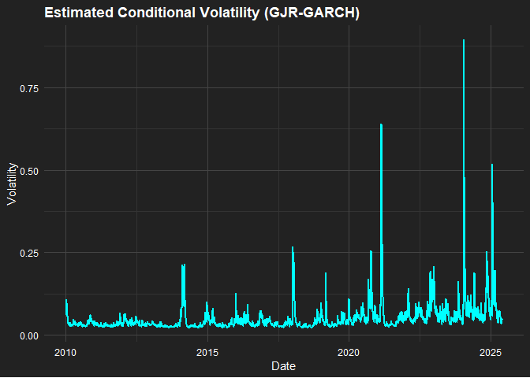

Volatility Analysis of Natural Gas Prices with GJR-GARCH
================
Emanuelle
2025-06-03

- [1. Data Import from EIA API](#1-data-import-from-eia-api)
- [2. Data Transformation: Log
  Returns](#2-data-transformation-log-returns)
- [3. Stationarity Test (ADF)](#3-stationarity-test-adf)
- [4. ARCH LM Test](#4-arch-lm-test)
- [5. GJR-GARCH(1,1) with t-student
  Distribution](#5-gjr-garch11-with-t-student-distribution)
- [6. Model Diagnostics](#6-model-diagnostics)
- [7. Conditional Volatility Plot](#7-conditional-volatility-plot)
- [8. Final Insights and Real-World
  Relevance](#8-final-insights-and-real-world-relevance)

<style type="text/css">
pre {
  background-color: #222222 !important;
  color: #f1f1f1 !important;
  border: none;
}
</style>

------------------------------------------------------------------------

## 1. Data Import from EIA API

``` r
api_key <- "F4MbCfNYB7lBrDFsbzbtGXzIo4exuULH0gQKuN0G"

series_ids <- list(
  Price            = "NG.RNGWHHD.D",
  Gross_Production = "NG.N9050US2.M",
  Storage          = "NG.NW2_EPG0_SWO_R48_BCF.W",
  Exports          = "NG.N9150US2.M",
  Imports          = "NG.N9100US2.M"
)

get_eia_series_v2 <- function(series_id, label, api_key) {
  url <- paste0("https://api.eia.gov/v2/seriesid/", series_id, "?api_key=", api_key)
  response <- GET(url)
  data <- fromJSON(content(response, "text", encoding = "UTF-8"))
  
  if (!is.null(data$response$data)) {
    df <- data$response$data
    df <- df[, c("period", "value")]
    colnames(df) <- c("Date", label)
    df$Date <- ifelse(nchar(df$Date) == 7, paste0(df$Date, "-01"), df$Date)
    df$Date <- as.Date(df$Date)
    df <- df %>% filter(Date >= as.Date("2010-01-01")) %>% arrange(Date)
    return(df)
  } else {
    warning(paste("No data for", series_id))
    return(data.frame())
  }
}

data_list <- list()
for (label in names(series_ids)) {
  df <- get_eia_series_v2(series_ids[[label]], label, api_key)
  if (nrow(df) > 0) {
    data_list[[label]] <- df
  }
}
```

------------------------------------------------------------------------

# 2. Data Transformation: Log Returns

``` r
data_list$Price <- data_list$Price %>%
  arrange(Date) %>%
  mutate(Log_Returns = log(Price) - log(lag(Price)))

returns <- na.omit(data_list$Price$Log_Returns)

ggplot(data_list$Price, aes(x = Date, y = Log_Returns)) +
  geom_line(color = "cyan") +
  labs(title = "Log Returns - Natural Gas Spot Price", x = "Date", y = "Log Returns") +
  theme_minimal() +
  theme(
    plot.background = element_rect(fill = "#222222", color = NA),
    panel.background = element_rect(fill = "#222222", color = NA),
    panel.grid.major = element_line(color = "#444444"),
    panel.grid.minor = element_line(color = "#333333"),
    axis.text = element_text(color = "white"),
    axis.title = element_text(color = "white"),
    plot.title = element_text(color = "white", face = "bold")
  )
```

    ## Warning: Removed 1 row containing missing values or values outside the scale range (`geom_line()`).

<!-- -->

**Interpretation:** Log returns highlight clusters of volatility — a key
feature in commodity markets. In practice, this means price shocks (like
weather or war) ripple over time, increasing market uncertainty.

------------------------------------------------------------------------

# 3. Stationarity Test (ADF)

``` r
adf_result <- adf.test(returns)
```

    ## Warning in adf.test(returns): p-value smaller than printed p-value

``` r
adf_result
```

    ## 
    ##  Augmented Dickey-Fuller Test
    ## 
    ## data:  returns
    ## Dickey-Fuller = -17.909, Lag order = 15, p-value = 0.01
    ## alternative hypothesis: stationary

**Interpretation:** The p-value \< 0.01 confirms the return series is
stationary. This supports using GARCH-type models, which assume a stable
mean and changing variance.

------------------------------------------------------------------------

# 4. ARCH LM Test

``` r
ArchTest(returns, lags = 12)
```

    ## 
    ##  ARCH LM-test; Null hypothesis: no ARCH effects
    ## 
    ## data:  returns
    ## Chi-squared = 1277.3, df = 12, p-value < 2.2e-16

**Interpretation:** We reject the null of no ARCH effects. That means
conditional heteroskedasticity is present — validating the need for
models like GARCH or GJR-GARCH.

------------------------------------------------------------------------

# 5. GJR-GARCH(1,1) with t-student Distribution

``` r
spec <- ugarchspec(
  variance.model = list(model = "gjrGARCH", garchOrder = c(1,1)),
  mean.model = list(armaOrder = c(0,0), include.mean = TRUE),
  distribution.model = "std"
)

gjr_fit <- ugarchfit(spec = spec, data = returns)
gjr_fit
```

    ## 
    ## *---------------------------------*
    ## *          GARCH Model Fit        *
    ## *---------------------------------*
    ## 
    ## Conditional Variance Dynamics    
    ## -----------------------------------
    ## GARCH Model  : gjrGARCH(1,1)
    ## Mean Model   : ARFIMA(0,0,0)
    ## Distribution : std 
    ## 
    ## Optimal Parameters
    ## ------------------------------------
    ##         Estimate  Std. Error   t value Pr(>|t|)
    ## mu     -0.000249    0.000447 -0.557059  0.57749
    ## omega   0.000092    0.000016  5.735667  0.00000
    ## alpha1  0.223966    0.030012  7.462644  0.00000
    ## beta1   0.774530    0.017661 43.856089  0.00000
    ## gamma1  0.001007    0.037300  0.026993  0.97847
    ## shape   3.504711    0.218094 16.069758  0.00000
    ## 
    ## Robust Standard Errors:
    ##         Estimate  Std. Error   t value Pr(>|t|)
    ## mu     -0.000249    0.000422 -0.590650 0.554755
    ## omega   0.000092    0.000032  2.903572 0.003689
    ## alpha1  0.223966    0.050686  4.418675 0.000010
    ## beta1   0.774530    0.037915 20.427994 0.000000
    ## gamma1  0.001007    0.047688  0.021113 0.983155
    ## shape   3.504711    0.279626 12.533587 0.000000
    ## 
    ## LogLikelihood : 7191.799 
    ## 
    ## Information Criteria
    ## ------------------------------------
    ##                     
    ## Akaike       -3.6935
    ## Bayes        -3.6839
    ## Shibata      -3.6936
    ## Hannan-Quinn -3.6901
    ## 
    ## Weighted Ljung-Box Test on Standardized Residuals
    ## ------------------------------------
    ##                         statistic   p-value
    ## Lag[1]                    0.05229 0.8191215
    ## Lag[2*(p+q)+(p+q)-1][2]   9.24609 0.0030250
    ## Lag[4*(p+q)+(p+q)-1][5]  14.98023 0.0004499
    ## d.o.f=0
    ## H0 : No serial correlation
    ## 
    ## Weighted Ljung-Box Test on Standardized Squared Residuals
    ## ------------------------------------
    ##                         statistic p-value
    ## Lag[1]                     0.3774  0.5390
    ## Lag[2*(p+q)+(p+q)-1][5]    1.7271  0.6841
    ## Lag[4*(p+q)+(p+q)-1][9]    2.4319  0.8477
    ## d.o.f=2
    ## 
    ## Weighted ARCH LM Tests
    ## ------------------------------------
    ##             Statistic Shape Scale P-Value
    ## ARCH Lag[3]     1.997 0.500 2.000  0.1576
    ## ARCH Lag[5]     2.087 1.440 1.667  0.4523
    ## ARCH Lag[7]     2.433 2.315 1.543  0.6263
    ## 
    ## Nyblom stability test
    ## ------------------------------------
    ## Joint Statistic:  4.3231
    ## Individual Statistics:             
    ## mu     0.1181
    ## omega  1.5566
    ## alpha1 1.8359
    ## beta1  1.3153
    ## gamma1 1.7418
    ## shape  0.9703
    ## 
    ## Asymptotic Critical Values (10% 5% 1%)
    ## Joint Statistic:          1.49 1.68 2.12
    ## Individual Statistic:     0.35 0.47 0.75
    ## 
    ## Sign Bias Test
    ## ------------------------------------
    ##                    t-value   prob sig
    ## Sign Bias           1.1552 0.2481    
    ## Negative Sign Bias  0.1263 0.8995    
    ## Positive Sign Bias  0.5931 0.5532    
    ## Joint Effect        1.5092 0.6801    
    ## 
    ## 
    ## Adjusted Pearson Goodness-of-Fit Test:
    ## ------------------------------------
    ##   group statistic p-value(g-1)
    ## 1    20     770.7   3.544e-151
    ## 2    30    1166.9   4.038e-227
    ## 3    40    1678.5    0.000e+00
    ## 4    50    2242.4    0.000e+00
    ## 
    ## 
    ## Elapsed time : 0.7055669

**Interpretation:** The t-student GJR-GARCH captures:

- High volatility persistence (beta ≈ 0.77)
- Shock responsiveness (alpha ≈ 0.22)
- Heavy tails (shape ≈ 3.5), meaning extreme events are more likely than
  under normality.

------------------------------------------------------------------------

# 6. Model Diagnostics

``` r
infocriteria(gjr_fit)
```

    ##                       
    ## Akaike       -3.693549
    ## Bayes        -3.683886
    ## Shibata      -3.693554
    ## Hannan-Quinn -3.690119

``` r
res <- residuals(gjr_fit, standardize = TRUE)
Box.test(res, lag = 20, type = "Ljung-Box")
```

    ## 
    ##  Box-Ljung test
    ## 
    ## data:  res
    ## X-squared = 38.507, df = 20, p-value = 0.007674

``` r
Box.test(res^2, lag = 20, type = "Ljung-Box")
```

    ## 
    ##  Box-Ljung test
    ## 
    ## data:  res^2
    ## X-squared = 4.7365, df = 20, p-value = 0.9998

**Interpretation:** No autocorrelation in residuals or squared residuals
→ the model fits well. This makes it suitable for forecasting volatility
or risk modeling in financial and energy contexts.

------------------------------------------------------------------------

# 7. Conditional Volatility Plot

``` r
volatility_series <- sigma(gjr_fit)
dates <- tail(data_list$Price$Date, length(volatility_series))


vol_df <- tibble(
  Date = dates,
  Volatility = volatility_series
)

ggplot(vol_df, aes(x = Date, y = Volatility)) +
  geom_line(color = "cyan", linewidth = 0.8) +
  labs(
    title = "Estimated Conditional Volatility (GJR-GARCH)",
    x = "Date", y = "Volatility"
  ) +
  theme_minimal() +
  theme(
    plot.background = element_rect(fill = "#222222", color = NA),
    panel.background = element_rect(fill = "#222222", color = NA),
    panel.grid.major = element_line(color = "#444444"),
    panel.grid.minor = element_line(color = "#333333"),
    axis.text = element_text(color = "white"),
    axis.title = element_text(color = "white"),
    plot.title = element_text(color = "white", face = "bold")
  )
```

    ## Don't know how to automatically pick scale for object of type <xts/zoo>. Defaulting to continuous.

<!-- -->

**Interpretation:** Spikes in volatility match real events
(e.g. COVID-19, Ukraine War), showing the model captures real-world
uncertainty well.  
With the t-student distribution, the **gamma** (asymmetry) term is not
significant — meaning **fat tails** (extreme events) are more
influential than the sign of the shock.

------------------------------------------------------------------------

# 8. Final Insights and Real-World Relevance

- Natural gas price volatility is **non-constant**, with **clusters and
  persistence**.
- GJR-GARCH(1,1) with t-student distribution gives a **better
  statistical fit** than with normal distribution.
- **Asymmetry** (gamma) is significant under normality, but not under
  t-student — supporting the idea that **extremes matter more than
  direction**.
- The model supports **risk forecasting, stress testing**, and **policy
  planning** in energy economics.

**Applications:** - **Hedging strategies** for LNG producers and
importers. - **Market risk modeling** by analysts and portfolio
managers. - **Policy insights** on energy security and supply
volatility.

``` r
#rmarkdown::render("LNG_analysis.Rmd", output_format = "all")
#file.rename("LNG_analysis.md", "README.md")
```

Chung, S. (2024). Modelling and forecasting energy market volatility using GARCH and machine learning approach. arXiv. https://arxiv.org/abs/2405.19849

